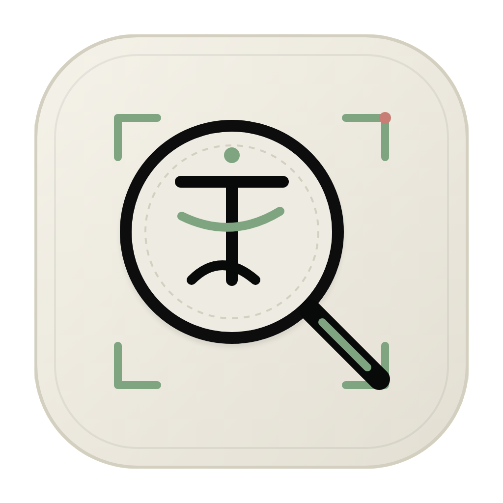

<div align="center">



# 🔍 Translate Lens

**Screenshot → translate → done. A tiny desktop lens for Chinese → Vietnamese and more.**

Clipboard-first OCR + text translation in a 500px popup. Bring your own key. No server. No tracking.


[Features](#-features) · [Quickstart](#-quickstart-5-minutes) · [BYOK Setup](#-byok-setup) · [How It Works](#-how-it-works) · [Stack](#-tech-stack)

</div>

---

## ✨ Features

| | What you get |
|---|---|
| 📋 **Clipboard OCR** | Screenshot → `⌘V` → translated. Reads PNG / JPG / WEBP / BMP from clipboard, auto-prepares image (resize, JPEG fallback) before sending to vision model. |
| ⌨️ **Manual mode** | Type or paste up to 2,000 chars. `⌘ + ↵` to translate. Char counter, quick-paste, one-click clear. |
| 🈳 **Pinyin included** | Chinese input automatically returns pinyin alongside original + translation. |
| 🔑 **BYOK, your keys stay yours** | Groq or OpenRouter. Keys stored in OS Keychain via Tauri secrets plugin — never in code, never on a server. |
| 🌍 **5 target languages** | Vietnamese (default), English, Japanese, Korean, French. Auto-detects source language. |
| 📌 **Always-on-top popup** | 500 × ≤700 auto-resizing window with drag region, Monkeytype 9009-inspired theme. |
| 🔄 **Auto-updater** | Built-in Tauri updater — check + install new versions from Settings. |

## 🖥️ How It Works

```
1. Upload  →  drop image / ⌘V clipboard image  →  vision model OCR + translate
2. Paste   →  type / paste text                →  text model translate
3. Result  →  Original · Pinyin (if ZH) · Translation — each with copy button
```

Default flow is **Chinese → Vietnamese** (`ZH → VI`), tuned for fast reading.

### AI models (per provider)

| Provider | Text | Image / Vision |
|----------|------|----------------|
| **Groq** _(default)_ | `openai/gpt-oss-120b` | `qwen/qwen3.8-27b` |
| **OpenRouter** | `qwen/qwen-3-32b` | `qwen/qwen2.5-vl-32b-instruct` |

Structured JSON output via `ai` SDK + Zod: `detectedLanguage`, `detectedText`, `translatedText`, `pinyin`.

## 🚀 Quickstart (5 minutes)

**1. Prerequisites**

- Node 20+ + `pnpm` (`npm i -g pnpm`)
- Rust stable (`rustup update stable`)
- Tauri system deps — see [Tauri prerequisites](https://tauri.app/start/prerequisites/)

**2. Install + run**

```bash
pnpm install
pnpm tauri dev      # full desktop app (frontend on http://localhost:1420)
# or frontend only:
pnpm dev
```

**3. Build**

```bash
pnpm build          # frontend → dist/
pnpm tauri build    # full installer bundle
```

**4. Verify**

```bash
pnpm build                          # must compile with no TS errors
cargo check --manifest-path src-tauri/Cargo.toml   # Rust must compile
cargo clippy --manifest-path src-tauri/Cargo.toml  # lint clean
```

## 🔑 BYOK Setup

1. Open app → **Settings** (gear icon).
2. Pick provider: **Groq** or **OpenRouter**.
3. Get a key:
   - Groq: https://console.groq.com → API Keys → Create
   - OpenRouter: https://openrouter.ai/keys → Create
4. Paste key → **Lưu cấu hình** (saved to OS Keychain).
5. Translate. Switch provider anytime — presence dot shows which providers have stored keys.

> No key = friendly error pointing you to Settings. The app never ships with keys.

## 📁 Project Structure

```
translate-lens/
├── src/
│   ├── App.tsx                  # MemoryRouter + providers
│   ├── components/
│   │   ├── Popup.tsx            # window shell, auto-resize, drag region
│   │   ├── OcrUploadPanel.tsx   # clipboard / drag-drop image flow
│   │   ├── ManualInputPanel2.tsx# text input flow
│   │   ├── ResultPanel.tsx      # original / pinyin / translation cards
│   │   ├── ByokSettingsPanel.tsx# provider, key, language, updater, on-top
│   │   └── Toolbar.tsx          # mode navigation
│   ├── lib/
│   │   ├── translate.ts         # translate() — text + image, Zod-validated
│   │   ├── ai.ts                # model factory (Groq / OpenRouter)
│   │   ├── secrets.ts           # keychain IPC wrappers
│   │   ├── image.ts             # OCR image prep (resize/encode)
│   │   └── updater.ts           # Tauri updater helpers
│   ├── stores/
│   │   ├── preferences.tsx      # target lang, provider, in-memory keys
│   │   └── translation.tsx      # last result + origin route
│   └── constants.ts             # routes, limits, models, languages
├── src-tauri/
│   ├── src/lib.rs               # plugins: clipboard, fs, opener, updater, single-instance
│   ├── src/secrets.rs           # keychain get/set/delete commands
│   └── tauri.conf.json          # 500px popup, transparent, auto-update feed
├── mockup/                      # HTML design reference (Monkeytype 9009 theme)
└── docs/                        # plans: OCR, clipboard probe, updater, release
```

## 🧰 Tech Stack

- **Frontend:** SolidJS + TypeScript (strict) + Tailwind CSS v4 + Vite + Kobalte UI + lucide-solid
- **Backend:** Rust + Tauri v2 (clipboard-manager, fs, opener, os, process, updater, single-instance)
- **AI:** Vercel `ai` SDK + `@ai-sdk/groq` + `@openrouter/ai-sdk-provider`, Zod structured output
- **Fonts:** JetBrains Mono + Space Grotesk
- **Package manager:** pnpm

State rules: 3+ related signals → one colocated `createStore`; components never call `invoke` directly (side effects live in store actions or `src/lib/`); context only when 2+ components share state.

## 🔒 Privacy

- Keys → OS Keychain only.
- Images/text → sent **directly** from your machine to the provider you chose. No proxy, no analytics.
- Updater feed: `https://github.com/mphung97/translate-lens/releases/latest/download/latest.json` (signed).

## ⌨️ Shortcuts

| Action | Shortcut |
|--------|----------|
| Paste clipboard image/text | `⌘/Ctrl + V` |
| Translate from text box | `⌘/Ctrl + ↵` |
| Close popup | `Esc` |

## 🗺️ Roadmap

- [ ] Global hotkey to summon popup
- [ ] Real drag-drop file translate (currently logs accept/reject)
- [ ] Ruby / furigana rendering toggle
- [ ] More target languages
- [ ] Linux packaging polish

## 🤝 Contributing

PRs welcome. Match existing Tailwind `cn([...])` grouping + colocated-store patterns (see `AGENTS.md`). Run `pnpm build` + `cargo check` before opening a PR.

## 📄 License

MIT — see [LICENSE](LICENSE) *(add file if missing)*.
